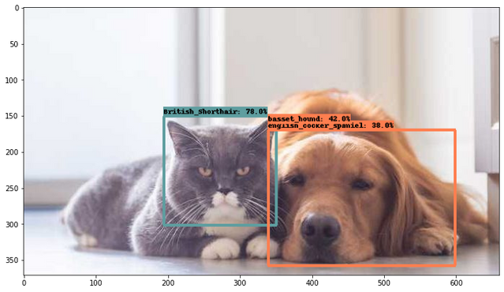

# E2E-Object-Detection-in-TFLite
This repository shows how to train a custom detection model with the [TFOD API](https://github.com/tensorflow/models/tree/master/research/object_detection) (TF2 and TF1), optimize it with TFLite, and perform inference with the optimized model.

</img>

## About the notebooks
- [`Training_a_pets_detector_model_within_minutes_with_TFOD_API.ipynb`](https://github.com/sayakpaul/E2E-Object-Detection-in-TFLite/blob/master/Training_a_pets_detector_model_within_minutes_with_TFOD_API.ipynb): Shows how to train a custom object detection model on the Pets dataset (non-eager mode).
- [`Running_inference_with_a_custom_TFOD_API_model.ipynb`](https://github.com/sayakpaul/E2E-Object-Detection-in-TFLite/blob/master/Running_inference_with_a_custom_TFOD_API_model.ipynb): Shows how to export a `SavedModel` graph from the trained checkpoint files, and run inference. 
- [`Object_Detection_in_TFLite.ipynb`](https://github.com/sayakpaul/E2E-Object-Detection-in-TFLite/blob/master/Object_Detection_in_TFLite.ipynb): Shows how to quantize the original model, generate a TFLite model, and run inference. 
- `colab_training/` - 
  - [`Fruits_Detection_Data_Prep.ipynb`](https://github.com/sayakpaul/E2E-Object-Detection-in-TFLite/blob/master/colab_training/Fruits_Detection_Data_Prep.ipynb): Shows how to prepare a object detection dataset in order to train it with the TFOD API in non-eager mode.
  - [`Training_MobileDet_Custom_Dataset.ipynb`](https://github.com/sayakpaul/E2E-Object-Detection-in-TFLite/blob/master/colab_training/Training_MobileDet_Custom_Dataset.ipynb): Shows how to fine-tune a MobileDet model to detect localize and detect fruits. It also shows how to optimize the fine-tuned model with TensorFlow Lite and run inference with the optimized model.

## Note
`Training_a_pets_detector_model_within_minutes_with_TFOD_API.ipynb` notebook uses Colab to demonstrate the training workflow but does not actually uses the Colab runtime for training. It uses Cloud TPUs.

## Model usage on mobile devices
Sample applications (both Android and iOS) are available [here](https://github.com/tensorflow/examples/tree/master/lite/examples/object_detection). 

## TFLite model files
Available [here](https://github.com/sayakpaul/E2E-Object-Detection-in-TFLite/releases/tag/v0.1.0) (currently available in dynamic-range only). It was generated from the first notebook (`Training_a_pets_detector_model_within_minutes_with_TFOD_API.ipynb`).

## Acknowledgement
I would like to thank the ML-GDE program for providing with GCP credits without which this project wouldn't have been possible. 

